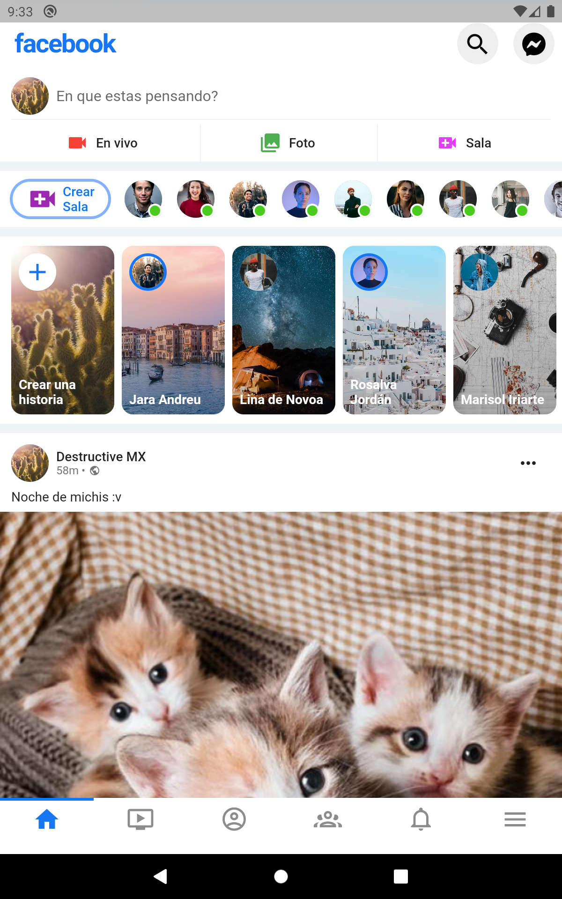

# Aplicacion de facebook en flutter

_Este proyecto de flutter copia la forma de de facebook app con el proposito de conocer la forma en la que trabaja flutter y todas las cosas que se pueden crear con este_

## Comenzando 🚀

_Estas instrucciones te permitirán obtener una copia del proyecto en funcionamiento en tu máquina local para propósitos de desarrollo y pruebas._

### Pre-requisitos 📋

_Antes de clonar el repositorio asegurate de tener:_


_Tener un emulador de dispositvo mobil puede ser Android o IOS:_ 

_IDE para poder compilar el proyceto:_
* [Visual Studio Code](https://code.visualstudio.com/)
* [Android Studio](https://developer.android.com/studio?hl=es-419&gclid=CjwKCAjwgviIBhBkEiwA10D2jyPpRWR2ZZYcxizyikEHgx0n71uRGj43NxocHuxYl3_mC1mdxzbSwBoC-JAQAvD_BwE&gclsrc=aw.ds) 

### Instalación 🔧

_Clonar el repositorio_
```
  git clone https://github.com/destructiv33/facebook-flutter.git
```

_Para Visual studio Code (recomendado)_
```
  cd facebook-flutter
```
```
  code .
```

_Al final solo seleccionas tu dispositivo F5 para compliar_

## Construido con 🛠️

[Flutter 2.7.0 <3.0.0](https://flutter.dev/docs/get-started/install)
 
 
_Dependencias_

* cupertino icons
* cached network image
* material design icons flutter

## Demo 📌

_Puedes ver un video aqui_

[Obtener video](https://github.com/destructiv33/facebook-flutter/blob/main/img/demo_gif.mp4)



_⌨️ con ❤️ por Daniel Ramirez._
* [Instagram](https://www.instagram.com/destructive.dev/) 😊